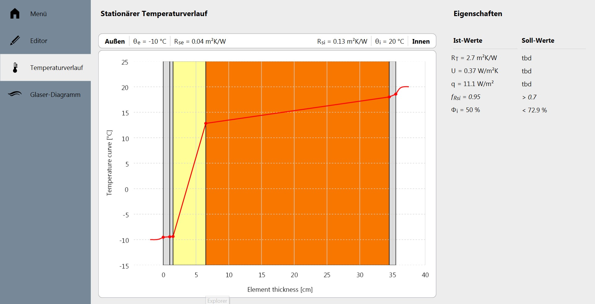
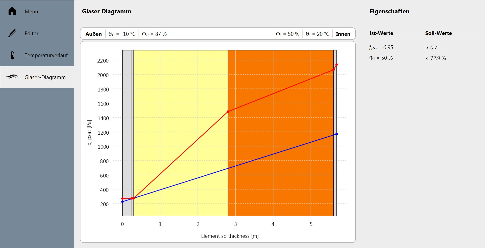

# BauphysikToolWPF

## Landing Page
- Overview of recently created building elements
- Saved persistent via built in SQLite Database

## Setup Page
- Build and edit the building element
- Set environment variables

## Stationary Temparature Curve

## Glaser Curve

