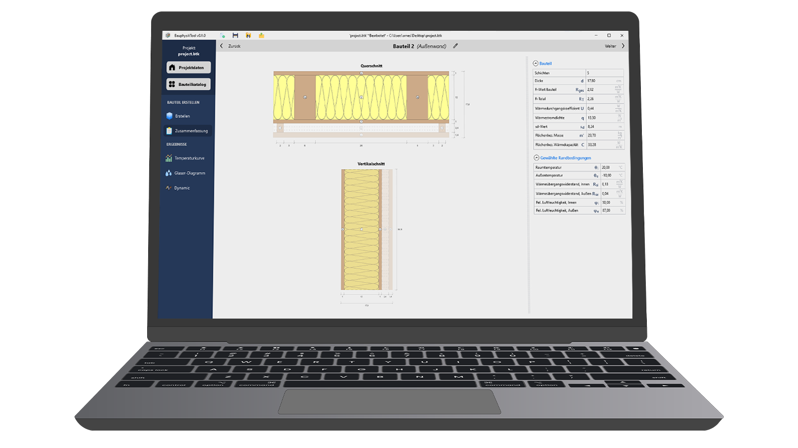

# BauphysikToolWPF

Installer der neuesten Version: [v0.1.0-alpha](https://bauphysik-tool.de/strapi/uploads/Bauphysik_Tool_Installer_v0_1_0_alpha_be64462fbc.msi) oder auf [bauphysik-tool.de](https://bauphysik-tool.de/downloads)

## Bauteile organisieren
- Alle projektbezogenen Elemente auf einen Blick
- Bauteilkatalog-Export als PDF (ab v0.2.0)

## Element erstellen
- Bauteilschichten hinzufügen und bearbeiten
- Umgebungsrandbedingungen festlegen

## Zusammenfassung
- Darstellung im Querschnitt
- Darstellung im Vertikalschnitt
- Übersicht aller relevanten thermischen Eigenschaften des Bauteils

## Temperaturverlauf
- Stationärer Zustand
- Überprüfung auf Mindestwärmeschutzwerte nach DIN 4108-2 und GEG2023

# DEPLOYMENT

push a Tag to trigger Deployment

git tag v1.0.0-dev
git push origin v1.0.0-dev

